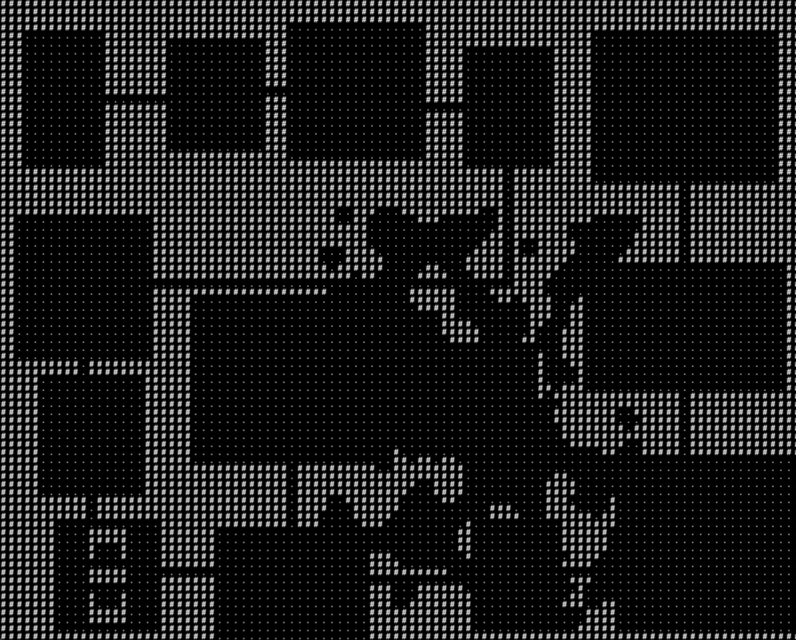

## Framing Thoughts
I’ve recently been addicted to Supergiant Games’ release of [Hades](https://www.supergiantgames.com/games/hades/), a dungeon crawler which draws from a long lineage of [roguelike](https://en.wikipedia.org/wiki/Roguelike) games that emulate or draw inspiration from the 1980’s game *Rogue*. The original Roguelikes, like *Rogue*, *Nethack*, and *Moria*, attempted to replicate the dungeon-crawl experience of Dungeons and Dragons by providing the player with randomized dungeon layouts for exploration and adventure, often using simplified Ascii graphics (given the computational limits of the day) which would print out to a console-like interface. 

Roguelikes are usually defined by several other characteristics, such as perma-death on each “run” through the randomized dungeon, and an absurdly high level of difficulty.  Many modern games have taken the general roguelike framework and spun it in different directions, such as *Hades’* integration with *Diablo’s* action-rpg combat and isometric dungeon layout. I really love the genre, given the high level of replayability driven by its reliance on procedurally-generated content. 

I’ve always had a pipe-dream of writing my own “vanilla” roguelike, primarily because of the DnD tie-in, and the fact that the Ascii interface would allow me to focus on the algorithm implementations rather than generating graphics or art. I wrote a really crappy one in Java while I was in school, which was fun and interesting in and of itself, but obviously I’ve grown as a programmer since then. There are a lot of pieces that I would go back and re-do / re-write - than most significant one being the dungeon generator that I had originally implemented, which basically just vomited a bunch of random squares onto the screen next to each other to represent “rooms.” 

As a first (and maybe final, who knows) step towards the end goal of a well-written roguelike, I took some mornings / evenings this November to try to write a better dungeon generator, in lieu of National Novel Writing Month.

## The End Result

Here’s where I’ve been able to get as a first draft of the process - as you can see, the core generator is able to construct evenly-spaced rooms across the map which are connected by hallways. Of course, empty rooms and hallways would be quite boring for a dungeon delver to explore, so I wanted to throw in some additional content to create more interesting spaces for adventure. 

I really like the idea of the player stumbling upon some old shrine or busted-down walls as they’re exploring the dungeon, so I allowed the generator to optionally construct pre-fabricated rooms that pull hand-crafted content into the dungeon. You can see an example of one of these prefab rooms in the bottom-left.

I also like thinking about the underlying “ground” within which the dungeon was constructed. Maybe, in the world of the game, the dungeon’s architect might accidentally dig into a previously undiscovered cave system, providing some more natural geometries for the player to explore. As you can see near the middle of this map, the dungeon generator can construct randomly-sized cave structures which might break into and connect between rooms. 

## The Implementation

The solution I ended up on, after reading various posts in the [roguelike development](https://www.reddit.com/r/roguelikedev/) subreddit, content on [RogueBasin](http://www.roguebasin.com/index.php?title=Main_Page), and a [tutorial](http://rogueliketutorials.com/tutorials/tcod/) which showcases the value-add of the python library [tcod](https://github.com/libtcod/python-tcod), I decided to implement the room placement using a [binary space partitoning (bsp)](https://en.wikipedia.org/wiki/Binary_space_partitioning) tree, which randomly partitions the map into subsections that place boundaries on where distinct rooms can be placed. This guarantees no rooms will overlap and makes sure that the room distribution is approximately uniform across the map, so that there are no “dead” spaces on the screen that aren’t utilized to create content for the player.

The cave systems are generated using [cellular automata](https://en.wikipedia.org/wiki/Cellular_automaton) which tend to create natural-looking curvature if run across several iterations. 

The prefab rooms are simply pulled from a json file which are maintained by an object that looks up candidate prefab rooms based on the room dimension that the core dungeon builder is trying to lay down. So if the generator constructs a room that is 10x16 cells, it will check to see if there is a prefab room with those same dimensions. Currently it will always lay down a prefab candidate if it is able to, but this could easily be made probabilistic.

Finally, the hallway generator simply takes the list of rooms and iteratively connects each room to a different random room. This guarantees that the dungeon will be well-connected, but the process obviously isn’t encouraged to create interesting room relationships, such as cycles or long interconnected room “gauntlets,” which might be good places for treasure in a final game. 

## Closing Thoughts

This was a pretty fun project to work through. I’d still like to improve the hallway generator and add more complex subprocesses, such as door placement, loot generation, multi-floor dungeons, etc, etc, etc, but I think it generates interesting-enough dungeons that will be a good starting point for any future game-building projects I might take on. Significantly, since the output is just a string of ascii characters which represent the dungeon layout, it should be simple enough to modularize the dungeon generator and pull it into other games later on (or just use it on its own for a real-life DnD game). 
