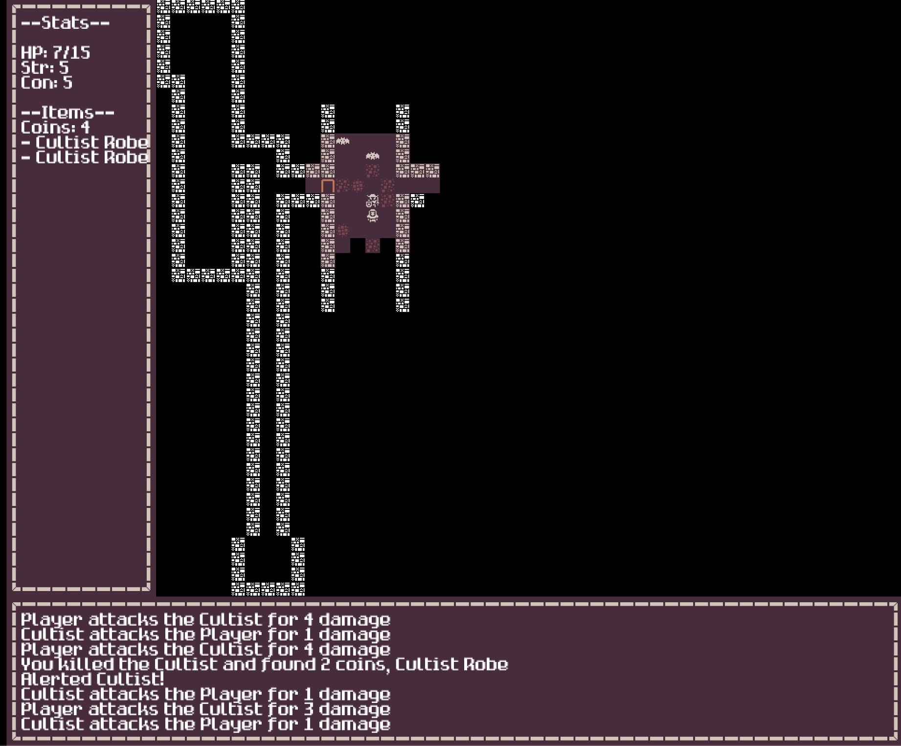

Some friends and I have started tinkering with building a [Roguelike](https://en.wikipedia.org/wiki/Roguelike) in Go - mostly for the fun of it, but at least partially to get some practice writing and thinking about problems in Go. 

|  |
|:--:|
| *Fight cultists and bats in your browser [here](https://goofy-lamport-0fbbf0.netlify.app/)!*|

We used [this devlog](https://www.fatoldyeti.com/posts/) as a starting point, but have mostly gone our own way outside of some initial architectural setup and the recommendation to use [Ebiten](https://ebiten.org/) as a game engine. Ebiten in particular is very cool because it can compile to [wasm](https://webassembly.org/) which means we can embed the game in a webpage. [Kenney](https://www.kenney.nl/assets) provides fantastic free game assets that we're using for the tileset. 

We have [Netlify](https://www.netlify.com/) setup to re-deploy the project whenever a commit gets pushed to `main`, so you should hypothetically be able to see the current build of our silly little hobby project [here](https://goofy-lamport-0fbbf0.netlify.app/) if you're curious. No idea how long that link will stay alive - hopefully for awhile.

Currently we have implemented: 

- Random dungeon generation (currently generating rooms using a binary-space-partitioning, but we also have an algorithm that will generate caves using cellular automata)
- Line-of-sight and some very rudimentary lighting systems (you'll see lit candelabras at the end of long hallways)
- Bats that move randomly!
- Cultists that will chase you if you alert them (very naively - ideally their pathfinding would use A* but for now its very simple)
- Loot
- Combat whenever actors move into the same tile space which is based on RPG-esque stats
- Inventory / loot
- A fun random Lovecraftian deity gets randomly generated as the curator of the dungeon (this mechanically does nothing but adds some fun flavor)

Up next to implement: 

- UI improvments around inventory management
- Loot that actually does things
- Efficiency improvements - there's a noticeable deprecation in snappiness in the webassembly build, not sure why that is yet. 
- More enemies!
- More loot!
- More room types!
- More flavor text!
- Some type of actual game loop - currently the win/lose conditions are very simple, so the question is: what is the *point* of the game? 
    - A full dungeon crawl with multi-floored dungeons? 
    - Perhaps a quick game loop where you go in, try to do something in the single screened dungeon (stop a ritual? eliminate all the enemies? find some essential treasure?) then come back out to some type of "shop" screen to spend your loot before entering a slightly harder dungeon? 
    - An overworld with multiple dungeons?
- More theme -  I think this would be cool if it was as Lovecraftian as possible - maybe set in the 20s / 30s? Or maybe medieval Lovecraft? Who knows!

I'll maybe try to keep posting about this little hobby project as more stuff happens with it (if more stuff happens with it) - but for now its very fun to tinker with. We're having a good time with it.

*"In his house at R'lyeh dead Cthulhu waits dreaming..."*

