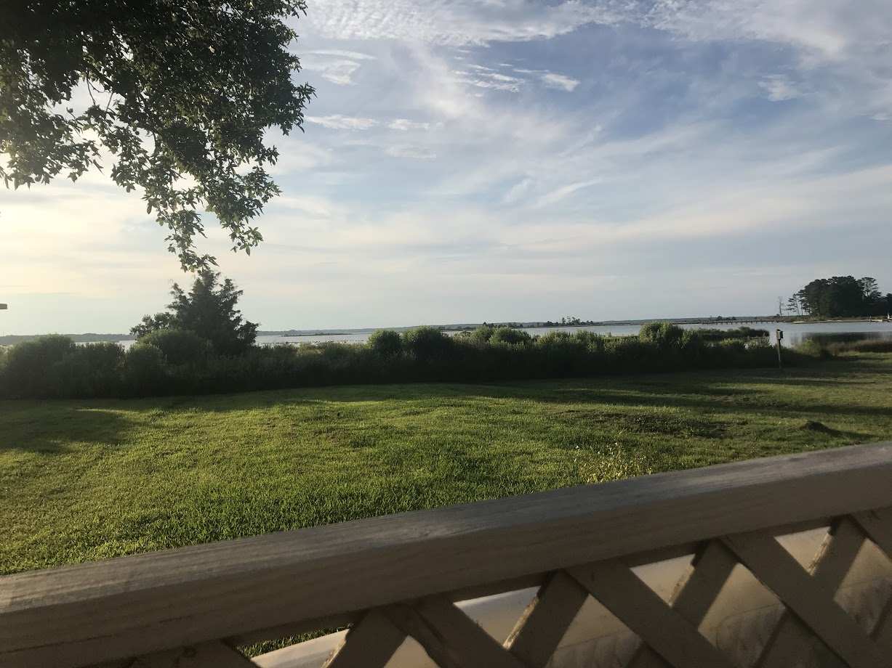

Erin and I just got back from a quick trip to White Stone, Virginia, which is nestled in a little crook between the mouth of the Rappahannock River and the Chesapeake Bay. We stayed in a tiny waterfront cottage with a couple of kayaks and a paddleboard, so we were able to get out on the water and do some exploring. On the first night of kayaking, we found a large solitary sandbar which was about 20 minutes away and looked out onto the bay, so each day we ended up taking food and books out with us and set up camp. It was a fantastic way to get some beach time in the strangeness and isolation of the current COVID-saturated era. 

This week of vacation has been much-needed. I was definitely beginning to feel the weight of being cooped up at home for the past four-ish months, so it was really nice to get a change of scenery for a few days. 

I spent most of my time reading, so I was able to get through some books that have been on my radar for awhile:

I binge-watched the Netflix adapatation of [Haunting of Hill House](https://www.imdb.com/title/tt6763664/) a few years ago, and had always meant to read Shirley Jackson's original horror story. Honestly, the relationship between the two is pretty tenuous, so I don't know how comparable the book is to the television series, but the novel was fantastic. Lots of interesting reflections on self-doubt and the role that it plays in defining the in-group and out-group in a community under pressure and stress. I think there's probably a good amount of tie-in with Rene Girard's  [theory of mimetic desire and the scapegoat mechanism](https://www.iep.utm.edu/girard/), especially as Nellie slowly degrades psychologically under the haunting effects of Hill House. I love this quote from the beginning of the book: 
>Hill House, not sane, stood by itself against its hills, holding darkness within; it had stood so for eighty years and might stand for eighty more. Within, walls continued upright, bricks met neatly, floors were firm, and doors were sensibly shut; silence lay steadily against the wood and stone of Hill House, and whatever walked there, walked alone.

Very spooky indeed. 

I also finished Dee Brown's [Bury My Heart at Wounded Knee: An Indian History of the American West](https://en.wikipedia.org/wiki/Bury_My_Heart_at_Wounded_Knee)  , is essentially a history of Westward Expansion told from the perspective of "west, looking east." This book was published in 1970, and I believe it has been pretty influential in developing the national conversation around alternative perspectives on westward expansion which don't fall into tropes that mythologize the west as a glorious example of American success. 

I'm glad I read it, but it was difficult to get through. Obviously the United States did not treat the Native American tribes kindly, but I didn't realize just how repetitively and horrifically callous the U.S. strategy actually was. My personal reflection on the consistently terrible  treatment of Native Americans by the United States has been driven home even further by the recent flare-up of conversation around the [symbolic role of Mount Rushmore](https://www.usatoday.com/story/travel/columnist/2020/07/13/mount-rushmore-native-american-side-story-still-missing/5402909002/), and again, a lack of context, or even awareness that there is no single stable lens of "truth" through which to view history.

Protest the Hero's recently released concept album [Palimpsest](https://protestthehero.bandcamp.com/album/palimpsest), which chronicles various events of American history, talks about Mount Rushmore specifically on the song "Little Snakes," emphasizing that an alternative perspective on the monument views it as a treaty-violating desecration of the Black Hills, which are historically sacred to the Lakota Tribe:

>Disembodied heads  
Disembowel the earth  
A monument of our arrogance  
A monolith of our bloated bunk, self-worth  
Disembodied heads  
Disembowel the earth

Through my church's [iniatives](https://episcopalchurch.org/sacred-ground) and lots of self-reflection over the past couple of years, I've been thinking a good amount about whiteness, systemic racism, and the role that I play (consciously or  unconsciously) in systems that oppress or hurt others. Within that reflection, I've primarily been thinking about the ways that race in America has advantaged white people and disadvantaged black people, but over the past few weeks I've been realizing that the very-much-alive legacy of American slavery is one story among many. The system that props up whiteness in relation to native communities is definitely a blind spot for me, and I need to be better about acknowledging it, learning about it, and existing in a way that aids, abets, and lifts up those who are suffering under these systems. 

Although James Cone's *God of the Oppressed* is primarily written for the black community, I think this quote is especially relevant here: 

>The Christian community, therefore, is that community that freely becomes oppressed, because they know that Jesus himself has defined humanity's liberation in the context of what happens to the little ones. Christians join the cause of the oppressed in the fight for justice not because of some philosophical principle of "the Good" or because of a religious feeling of sympathy for people in prison. Sympathy does not change the structures of injustice. The authentic identity of Christians with the poor is found in the claim which the Jesus-encounter lays upon their own life-style, a claim that connects the word "Christian" with the liberation of the poor. Christians fight not for humanity in general but for themselves and out of their love for concrete human beings.

I think that's probably all for now - I just wanted to get some thoughts down while they were fresh. There's obviously a lot to unpack regarding race in America and its relationship to Cone's liberation theology, and I don't pretend that this is anything close to a cohesive post. But I also don't have any thoughts that are anywhere near coherent currently, and I want this blog to be a snapshot of what I'm working out at a given point in time - not just well-polished mind-blowing writing (if that was the criteria, I'd never post anything). 

So take this scatterbrained post for what it is. 

That's probably all for now - to close, here's a picture of where we were staying this week:

### Currently Reading
- N.K. Jemisin's [The Fifth Season](http://nkjemisin.com/books/the-fifth-season/)

### Currently Watching
- Unsolved Mysteries

### Currently Listening To
- The Magnus Archives (just hit the Season 4 Finale, WOW)
- Opeth's [Ghost Reveries](https://en.wikipedia.org/wiki/Ghost_Reveries)
